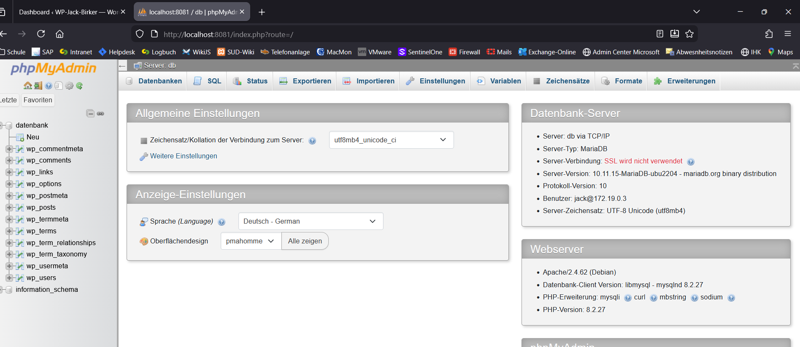

# wp-int-<teamkürzel>

## Setup der lokalen WordPress Umgebung

1. Docker Compose starten mit:
docker compose up -d

2. WordPress-Installer unter http://localhost:8080 öffnen und Installation abschließen.

3. phpMyAdmin Zugriff unter http://localhost:8081 mit Datenbank-Benutzeranmeldedaten.

## Screenshots

